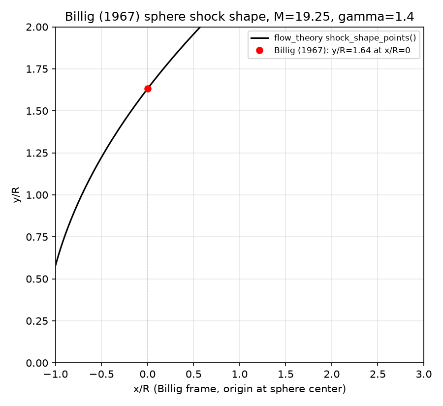

# Billig (1967), Blunt-Body Bow-Shock Shape

Validation context for `flow_theory.shock_shape.shock_shape_billig()` and
`shock_shape_points()` against Billig (1967)[^billig_1967], J. Spacecraft
Rockets, 4(6), 822-823 -- the paper the hyperbola fit was designed from (see
[Bow-Shock Shape theory](../../../theory/shock_shape.md)).

## Case Description

Billig's paper includes a worked numerical example, attributed to Storer's
data, for a spherically-blunted nose at a high-Mach, high-altitude reentry
condition:

- $M_\infty = 19.25$
- 200,000 ft altitude
- Sphere nose, $\gamma = 1.4$ (perfect gas)

For this condition Billig reports three numbers directly in the text:

- $R_c/R = 1.16$ (shock radius of curvature at the nose, Eq. 4)
- Normal-shock density ratio $\rho_2/\rho_1 = 5.92$ (used to justify the
  perfect-gas $\gamma=1.4$ approximation against a real-gas value of 14.6)
- $y/R = 1.64$ at $x/R = 0$, where Billig's plot origin is the **sphere
  center**, not the nose tip (`flow_theory`'s convention places $x=0$ at the
  nose tip, i.e. Billig's $x=0$ is `flow_theory`'s $x = R_\mathrm{nose}$)

## A Sign Bug Found During This Validation

While reproducing the $y/R=1.64$ point, the as-implemented
`shock_shape_billig()` did not match Billig's reported value, and a sweep
over lateral distance $s$ showed the shock locus moving unboundedly
*upstream* (more negative $x$) as $s$ increased -- the opposite of the
physically-expected behavior (the shock should sweep back downstream,
approaching the freestream Mach cone asymptote far from the nose).

Re-deriving the hyperbola from standard conic-section geometry (vertex
offset by $\Delta$, asymptote slope $\cot\theta$) showed the correct form
is:

$$x_\mathrm{shock}(s) = -\Delta + R_c \cot^2\theta\left(\sqrt{1 + \tan^2\theta\, \frac{s^2}{R_c^2}} - 1\right)$$

The implemented code instead computed
$x_\mathrm{shock}(s) = -\left[\Delta + R_c\cot^2\theta(\ldots)\right]$,
distributing the negative sign across the whole hyperbola bracket instead
of just $\Delta$. This has been fixed in `shock_shape.py`, the
[theory doc](../../../theory/shock_shape.md), and the corresponding
regression test in `tests/test_shock_shape.py` (renamed
`test_shock_shape_billig_sweeps_downstream_with_lateral_distance`, checking
$x$ increases with $s$ rather than decreases). After the fix, the computed
$y/R$ at Billig's $x/R=0$ station matches his reported value (see Results
below).

## Results

Computed at $M_\infty=19.25$, $\gamma=1.4$, $R_\mathrm{nose}=1$ (all ratios
below are non-dimensional and independent of the actual nose radius units):

| Quantity | Billig (1967) | `flow_theory` | rtol |
|---|---|---|---|
| $R_c/R$ (Eq. 4) | 1.16 | 1.16208 | 1.8e-3 |
| $\rho_2/\rho_1$ (normal shock, $\gamma=1.4$) | 5.92 | 5.92012 | 2.0e-5 |
| $y/R$ at $x/R=0$ (sphere-center frame) | 1.64 | 1.63186 | 5.0e-3 |



The computed shock locus (black) passes through Billig's reported point
(red) at the sphere-center station to within the tolerance of his
3-significant-figure reporting.

## Pass/Fail Summary

| Check | Tolerance | Result |
|---|---|---|
| $R_c/R$ matches Eq. 4 worked example | rtol=5e-3 | Pass |
| Normal-shock density ratio matches perfect-gas $\gamma=1.4$ value | rtol=5e-3 | Pass |
| $y/R$ at Billig's $x/R=0$ matches worked example | rtol=5e-3 | Pass |
| Shock locus sweeps downstream (not upstream) with increasing $s$ | monotonic | Pass |

## Reproduce

```bash
pytest tests/test_vnv_billig.py -v
```

The comparison figure is regenerated by a standalone script (matplotlib is
not a project dependency, matching the precedent in similarity-bl's own VnV
scripts):

```bash
pip install matplotlib -q
python3 docs/vnv/validation/billig_1967_shock_shape/scripts/generate_figure.py
```

[^billig_1967]: Billig, F.S. (1967). *Shock-wave shapes around spherical- and cylindrical-nosed bodies*. J. Spacecraft Rockets, 4(6), 822-823.
