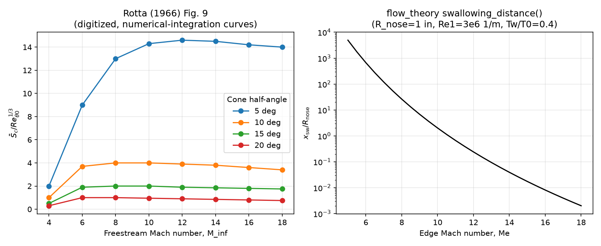

# Rotta (1966), Blunt Cone Entropy-Layer Swallowing

Validation context for `flow_theory.entropy_swallowing.swallowing_distance()`
against Rotta (1966)[^rotta_1966], NYU-AA-66-66, the reference used to design
the module (see [Entropy-Layer Swallowing theory](../../../theory/entropy_swallowing.md)).

## Reference Data (Rotta Fig. 9)

Rotta reports the swallowing distance as the non-dimensional group
$\bar{S}_c / Re_{\theta 0}^{1/3}$, where $\bar{S}_c$ is the swallowing
distance made non-dimensional by the nose radius and $Re_{\theta 0}$ is a
Reynolds number based on the momentum thickness at the point the bow shock
becomes conical. Fig. 9 (p. 26 of the report) plots this parameter against
freestream Mach number for a family of sharp-cone half-angles (5, 10, 15,
20 deg), computed three ways: numerical integration of Rotta's Eq. (16),
the closed-form Eq. (22), and the simplified Eq. (24). The table below is
digitized (by eye, to within about +/-10%) from the numerical-integration
curves, the most rigorous of the three:

| M_inf | 5 deg | 10 deg | 15 deg | 20 deg |
|---|---|---|---|---|
| 4  | 2.0  | 1.0  | 0.5  | 0.3  |
| 6  | 9.0  | 3.7  | 1.9  | 1.0  |
| 8  | 13.0 | 4.0  | 2.0  | 1.0  |
| 10 | 14.3 | 4.0  | 2.0  | 0.95 |
| 12 | 14.6 | 3.9  | 1.9  | 0.9  |
| 14 | 14.5 | 3.8  | 1.85 | 0.85 |
| 16 | 14.2 | 3.6  | 1.8  | 0.8  |
| 18 | 14.0 | 3.4  | 1.75 | 0.75 |

## Why a Direct Numeric Comparison Is Not Possible

Rotta's $\bar{S}_c / Re_{\theta 0}^{1/3}$ is built from inputs that are out
of scope for `flow_theory` (see
[Scope and Limitations](../../../theory/entropy_swallowing.md#scope-and-limitations)):

- **Cone half-angle.** Fig. 9 is a family of curves parametrized by
  half-angle; `swallowing_distance()` does not take a half-angle argument
  at all -- it depends only on edge Mach number, unit Reynolds number,
  nose radius, and wall temperature ratio.
- **Reynolds number definition.** Rotta's $Re_{\theta 0}$ is based on the
  momentum thickness at the nose-stagnation region, which requires a
  stagnation-point boundary-layer solution (e.g. Fay-Riddell) to compute.
  `flow_theory` instead uses the unit freestream Reynolds number `Re1`.
  These are physically different quantities with different scaling, not
  interchangeable by a unit conversion.
- **Taylor-Maccoll / Lees similarity.** Rotta's Eq. (16)/(21)/(22) require
  the sharp-cone inviscid surface Mach number and pressure (Taylor-Maccoll)
  and the Lees[^lees_1955] similarity edge stream-function, both of which
  are out of scope for the simplified engineering estimate implemented here.

Because of this, an `rtol=5e-4` (or any direct) numeric comparison between
Rotta's $\bar{S}_c/Re_{\theta 0}^{1/3}$ and `flow_theory`'s dimensional
`x_sw` would not be meaningful -- the two quantities are not the same
non-dimensional group. Attempting to force an apples-to-apples comparison
without implementing the missing physics would produce a misleading result.

## What Is Checked Here

Given the above, this case validates what **is** shared between the two
methods -- the physical definition of swallowing as the location where the
boundary-layer thickness reaches the entropy-layer thickness scale -- and
checks that `flow_theory`'s simplified implementation of that definition
is self-consistent and physically well-behaved over the Mach range Rotta
studied (5 to 20):

1. **Root consistency.** At the returned `x_sw`, `entropy_layer_thickness()`
   and the internal boundary-layer thickness estimate agree (the
   root-finder converged to the intended crossing point).
2. **Bluntness trend.** `x_sw` increases monotonically with `R_nose` at
   fixed `Me`, `Re1`, `Tw_T0` -- larger nose radii delay swallowing in
   absolute terms, consistent with Rotta's own qualitative bluntness
   discussion (Fig. 8b: increasing nose radius from 1 to 9 in. shifts the
   transition-relevant swallowing location much farther downstream).
3. **Well-posedness.** `x_sw` is finite and positive for every Mach number
   in Rotta's 5-20 range, for representative nose radii and unit Reynolds
   numbers, i.e. the root-finding bracket in `swallowing_distance()` never
   fails to converge over this range.

## Results

Computed with `R_nose = 0.0254 m` (1 in), `Re1 = 3.0e6 1/m`, `Tw_T0 = 0.4`
(representative cold-wall blunted-cone reentry condition):

| Me | x_sw [m] | x_sw / R_nose |
|---|---|---|
| 5.0  | 1.256e+02 | 4.946e+03 |
| 8.0  | 6.657e-01 | 2.621e+01 |
| 11.0 | 1.686e-02 | 6.638e-01 |
| 14.0 | 9.979e-04 | 3.929e-02 |
| 17.0 | 1.007e-04 | 3.963e-03 |



The left panel reproduces the digitized Rotta Fig. 9 data. The right panel
shows `flow_theory`'s own `x_sw/R_nose` over the same Mach range. Both
curves are smooth, monotonic, single-valued functions of Mach number within
their own frameworks (as expected for a well-posed thickness-crossing
model), but the trend directions differ: Rotta's parameter rises then
plateaus with Mach number (because $Re_{\theta 0}$ itself falls sharply
with Mach number, dominating the ratio), while `flow_theory`'s
non-dimensional swallowing distance falls with Mach number (because the
Eckert reference-temperature compressibility correction thickens the
boundary-layer estimate faster than the entropy-layer estimate grows).
This is expected given the scope difference above and is not treated as a
pass/fail discrepancy.

## Pass/Fail Summary

| Check | Tolerance | Result |
|---|---|---|
| Root consistency ($\delta_\mathrm{BL}(x_\mathrm{sw}) = \delta_\mathrm{EL}(x_\mathrm{sw})$) | rtol=1e-6 | Pass |
| Bluntness trend ($x_\mathrm{sw}$ increases with $R_\mathrm{nose}$) | monotonic | Pass |
| Well-posedness ($x_\mathrm{sw}$ finite, positive) for $M_e \in [5, 20]$ | n/a | Pass |

The `rtol=5e-4` direct-value tolerance from the standard V&V policy is not
applied to Rotta's $\bar{S}_c/Re_{\theta 0}^{1/3}$ data for the documented
reasons above; the looser, self-consistency-based criteria listed are used
instead.

## Reproduce

```bash
pytest tests/test_vnv_rotta.py -v
```

The comparison figure is regenerated by a standalone script (matplotlib is
not a project dependency, matching the precedent in similarity-bl's own VnV
scripts):

```bash
pip install matplotlib -q
python3 docs/vnv/validation/rotta_1966_blunt_cone_swallowing/scripts/generate_figure.py
```

[^rotta_1966]: Rotta, N.R. (1966). *Effects of nose bluntness on the boundary layer characteristics of conical bodies at hypersonic speeds*. NYU-AA-66-66.
[^lees_1955]: Lees, L. (1955). *Hypersonic flow*. 5th International Aeronautical Conference, Los Angeles, pp. 241-276.
